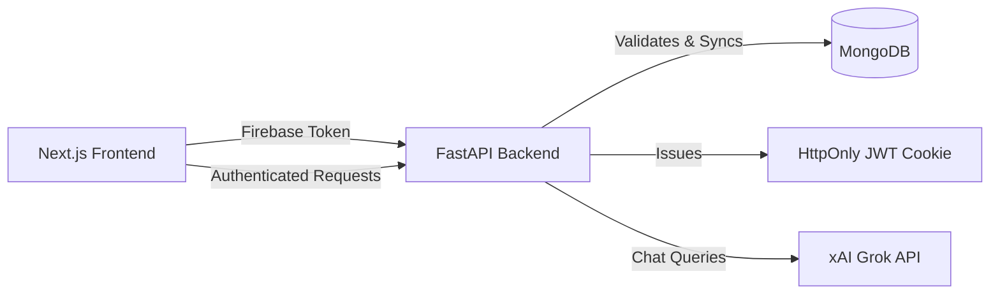

# KrishiMitra 🌾

> **Grow Smarter. Farm Better. With Precision AI.**

KrishiMitra (formerly AgroVision) is an enterprise-grade, AI-powered agricultural advisory platform designed specifically for smallholder farmers across India. It provides real-time crop disease detection, personalized income advice, localized government schemes, and a 24/7 AI farming assistant—all accessible through a simple, multilingual, and mobile-friendly web interface.

## 🌟 Key Features

1. **AI Disease Detection**: Upload a photo of an infected leaf, and our computer vision model will instantly identify the pathology, confidence level, and actionable treatment steps.
2. **Grok AI Assistant**: A 24/7 smart farming advisor powered by xAI's Grok. Ask questions in natural language and receive context-aware, localized advice.
3. **Role-Based Authentication**: Secure onboarding via Firebase with distinct `FARMER` and `ADMIN` roles, seamlessly synced to MongoDB via our custom JWT architecture.
4. **Admin Dashboard**: A secure telemetry hub for administrators to track registered farmers, platform usage, and active regions.
5. **Weather & Crop Planning**: Real-time microclimate intelligence, government scheme discovery, and a full-season crop calendar.
6. **Multilingual Support**: Fully localized into English, Hindi (हिंदी), and Marathi (मराठी) with persistent context switching.

## 🏗️ Architecture

KrishiMitra uses a decoupled modern stack optimized for speed and scalability:

- **Frontend**: Next.js 16 (App Router), React 19, Tailwind CSS v4, Framer Motion for micro-animations.
- **Backend**: FastAPI (Python), HTTPX (Async API Calls).
- **Database**: MongoDB (Atlas) for robust document storage.
- **Authentication**: Firebase Authentication (Client-side) synced with a custom HTTP-only JWT session layer on the backend.
- **AI Integration**: xAI (Grok API) for conversational intelligence.



## 📂 Project Structure

```text
📦 KrishiMitra
├── 📁 frontend/             # Next.js Application
│   ├── 📁 app/              # App Router Pages (dashboard, admin, assistant, etc.)
│   ├── 📁 components/       # Shared UI, Layouts, and Forms
│   ├── 📁 context/          # React Context (Auth, Language)
│   ├── 📁 locales/          # i18n Translation dictionaries
│   ├── 📁 lib/              # Firebase & API Utilities
│   └── 📄 middleware.ts     # Edge routing and Admin protection guard
└── 📁 backend/              # FastAPI Application
    ├── 📁 core/             # Settings, DB Connectors, Security
    ├── 📁 models/           # Pydantic Schemas
    ├── 📁 modules/          # API Routers (Auth, AI, Admin, Disease)
    ├── 📁 services/         # Business Logic (JWT, Weather, etc.)
    └── 📄 main.py           # Application Entry Point
```

## 🚀 Getting Started

### Prerequisites
- Node.js 20+
- Python 3.10+
- MongoDB Atlas cluster (or local instance)
- Firebase Project (Web credentials + Service Account Key)
- xAI Grok API Key

### 1. Backend Setup

```bash
cd backend
python -m venv venv
source venv/bin/activate  # On Windows: venv\Scripts\activate
pip install -r requirements.txt
```

**Environment Variables** (`backend/.env`):
Create a `.env` file in the `backend/` directory:
```ini
GROK_API_KEY=your_grok_api_key_here
OPENWEATHER_API_KEY=your_weather_key
DEBUG=True
ALLOWED_ORIGINS=["http://localhost:3000"]
MONGODB_URL=mongodb+srv://...
MONGODB_DB_NAME=krishimitra
JWT_SECRET_KEY=generate_a_random_32_char_hex
JWT_REFRESH_SECRET_KEY=generate_a_random_32_char_hex
```

**Firebase Service Account**:
Place your `firebase-service-account.json` inside the `backend/` directory.

**Run the Server**:
```bash
python main.py
```
The API will run on `http://127.0.0.1:8000`.

### 2. Frontend Setup

```bash
cd frontend
npm install
```

**Environment Variables** (`frontend/.env.local`):
Create a `.env.local` file in the `frontend/` directory:
```ini
NEXT_PUBLIC_API_URL=http://127.0.0.1:8000
NEXT_PUBLIC_FIREBASE_API_KEY=your_key
NEXT_PUBLIC_FIREBASE_AUTH_DOMAIN=your_domain
NEXT_PUBLIC_FIREBASE_PROJECT_ID=your_id
NEXT_PUBLIC_FIREBASE_STORAGE_BUCKET=your_bucket
NEXT_PUBLIC_FIREBASE_APP_ID=your_app_id
```

**Run the Client**:
```bash
npm run dev
```
The application will run on `http://localhost:3000`.

---

## 🛡️ Authentication Flow

1. User logs in via **Firebase** (Google or Email/Password) on the frontend.
2. The frontend extracts the **Firebase ID Token** and sends it to `/api/auth/sync`.
3. The backend **verifies the token** using the Firebase Admin SDK.
4. The backend upserts the user in **MongoDB**, setting the `role` (FARMER or ADMIN).
5. The backend generates a secure **JWT** and sets it as an `HttpOnly` cookie.
6. Next.js **Middleware** reads the cookie to protect specific routes (e.g., `/admin`).

## 🤝 Contributing
Contributions are welcome! Please follow standard enterprise open-source guidelines when opening pull requests.

## 📄 License
MIT License. Built with ❤️ for the agricultural community.
